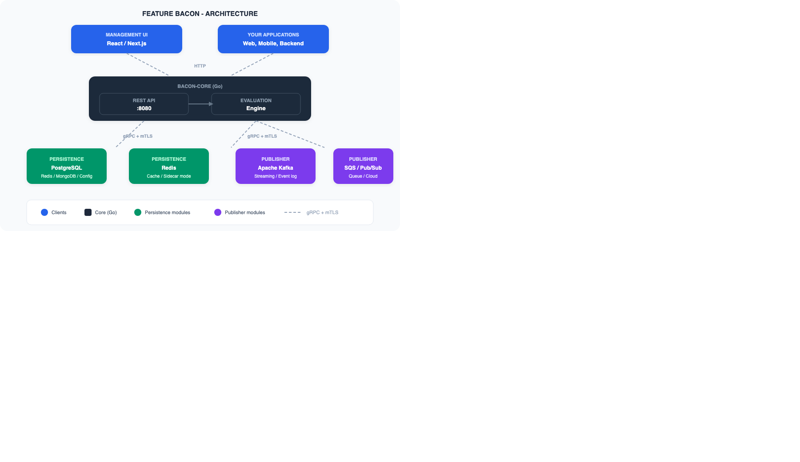
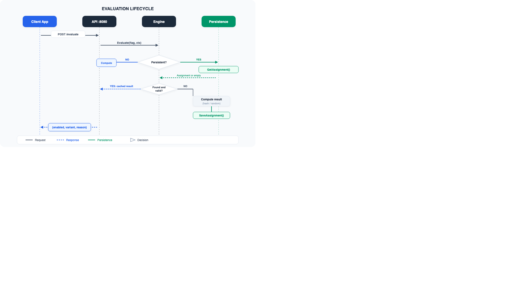
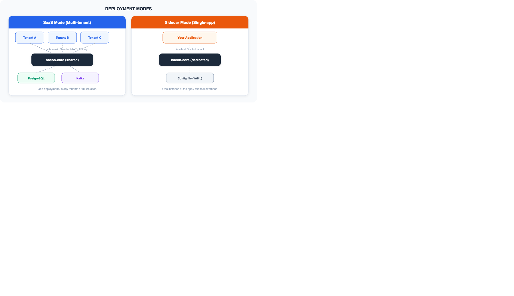

Feature flags shouldn't require a six-figure contract. That's the thought that kept nagging me as I watched team after team adopt commercial feature flag platforms, only to end up locked in, overpaying for seats, and unable to customize the one thing that mattered most to their workflow. After twenty years of building software — shipping flags through homegrown `if` statements, YAML files, database rows, and eventually expensive SaaS products — I decided to build the tool I always wanted. It's called **Feature Bacon**, it's open source, and it's built to be the last feature flag platform you'll ever need to evaluate.

## Why another feature flag tool?

The feature flag space isn't empty. LaunchDarkly, Flagsmith, Unleash, Split — they all exist and they all work. But every one of them forces a trade-off:

- **Open-source options** tend to be monolithic. Want Kafka integration? Hope the maintainers prioritize it. Need MongoDB instead of Postgres? Fork and maintain your own build.
- **Commercial platforms** charge per seat or per flag evaluation. At scale, costs grow faster than your infrastructure budget.
- **All of them** assume you'll run them one way: either self-hosted or SaaS, but rarely both with the same codebase and zero code changes.

Feature Bacon takes a different approach. The core evaluation engine is a single Go binary with **no database drivers and no broker SDKs compiled in**. Everything else — persistence, integrations, publishing — is a separate container communicating over gRPC with mutual TLS. You deploy only what you need. Nothing more.

## The architecture

The system is built around a simple principle: the core should do one thing well — evaluate flags — and everything else should be pluggable.

Each module is a **separate Docker image** implementing a standard gRPC service contract — either `PersistenceService` or `PublisherService`. This means:

- Swapping Postgres for MongoDB is a config change, not a code change
- Running Kafka *and* SQS simultaneously is just deploying two publisher containers
- Running with zero publishers is valid — events are silently discarded
- Adding a custom integration means implementing one gRPC interface

The core binary stays lean. No unused drivers, no dependency bloat.

## Three evaluation modes

Not all flags behave the same way, so Feature Bacon supports three distinct evaluation modes:

**Deterministic** — the same input always produces the same output. This is your classic hash-based bucketing. User `abc123` seeing variant `B` today will see variant `B` tomorrow, with no database lookup required. The computation is pure and stateless.

**Random** — each evaluation may return a different result. This is useful for random sampling, impression-based experiments, or any scenario where consistency per user doesn't matter.

**Persistent** — the result is stored so a subject sees the same outcome until TTL expires or the rules change. This requires a writable persistence module and is essential for A/B tests where you need sticky assignment across sessions and devices.

The evaluation engine resolves rules, rollout percentages, and targeting conditions using rich context — JWT claims, HTTP headers, IP addresses, session data, and custom attributes you define.

## Multi-tenant from day one

This is where most open-source tools fall short. Multi-tenancy is usually an afterthought, bolted on with schema-per-tenant hacks or shared tables with no real isolation.

Feature Bacon was designed multi-tenant from the start. Every request carries tenant context. Every database query is scoped. Every emitted event is tagged. Tenant resolution can happen via subdomain, header, JWT claim, or API key — configurable per deployment.

This design enables two deployment modes from the same codebase:

| Mode | Use case |
|------|----------|
| **SaaS** | One deployment serves many tenants with full isolation |
| **Sidecar** | One instance dedicated to a single application, implicit default tenant, minimal overhead |

Same binary. Same config format. Different operational model.

## Pluggable persistence

The persistence layer isn't an abstraction over an ORM — it's a separate process communicating over gRPC. This gives you real flexibility:

- **PostgreSQL** — full feature set including persistent assignments, CRUD operations, and audit trails. This is the recommended choice for most deployments.
- **Redis** — optimized for cache-oriented or sidecar deployments where you need sub-millisecond evaluation and can tolerate eventual consistency.
- **MongoDB** — document-oriented deployments, useful when your infrastructure already runs Mongo and you want to avoid adding another database.
- **Config file** — read-only, no database required. Flags defined in YAML, JSON, or TOML, managed as code in your repository. Persistent flags and sticky experiments aren't available in this mode, but for simple boolean toggles it's the lightest option.

## Pluggable integrations

Every flag evaluation can emit events — who evaluated what, when, with which result. Where those events go is up to you:

- **Apache Kafka** — for streaming and event log architectures
- **AWS SQS** — queue-based processing
- **GCP Pub/Sub** — cloud messaging
- **Generic gRPC** — forward events to any endpoint you control

Multiple publishers can run in parallel for fan-out scenarios. And again, zero publishers is a valid configuration.

## A/B testing and experimentation

Feature flags and experiments are two sides of the same coin, and Feature Bacon treats them that way. You can define multivariate experiments with traffic allocation, get stable variant assignment per subject, and collect evaluation events for analysis.

The persistent evaluation mode is key here — it ensures that a user assigned to variant `B` stays in variant `B` for the duration of the experiment, across sessions, devices, and API calls. When the experiment concludes, you flip the flag to the winning variant and clean up.

## Observability built in

Running a feature flag platform that you can't monitor is a liability. Feature Bacon exposes:

- **Prometheus-compatible metrics** labeled per tenant — evaluation counts, latencies, error rates, module health
- **Structured logging** with correlation IDs that trace a request from the API through the evaluation engine to every module it touches
- **Health endpoints** with per-module status — so your orchestrator knows not just that the core is running, but that it can actually reach its persistence and publisher modules

## The tech stack

| Layer | Technology |
|-------|-----------|
| Backend API + evaluation engine | **Go** |
| Management UI | **React** with **Next.js** |
| Inter-module communication | **gRPC** with **mTLS** |
| Metrics | **Prometheus**-compatible |
| Specifications | **OpenSpec** format with RFC 2119 requirements |

Go was the natural choice for the core — fast compilation, small binaries, excellent concurrency primitives, and a gRPC ecosystem that's mature and well-maintained. The evaluation engine needs to be fast and predictable, and Go delivers both.

The management UI is a Next.js application that talks to the core API over HTTP. It's where you create and manage flags, define targeting rules, configure experiments, and monitor evaluations.

## Open source with a commercial option

Feature Bacon is dual-licensed:

- **AGPL-3.0** for open-source use — you can use, modify, and distribute it freely. If you run a modified version as a network service, you must make your modifications available to users.
- **Commercial license** for organizations that can't comply with the AGPL — proprietary SaaS offerings, embedding without source disclosure, or simply wanting support and guarantees.

A **hosted SaaS version** is coming soon for teams that want the full platform without the operational overhead. Same engine, managed infrastructure, usage-based pricing that won't surprise you.

## Current status and what's next

Feature Bacon is in early stage. The specifications are comprehensive and in place — covering flag evaluation, management, A/B experiments, persistence, integrations, observability, and architecture. The backend implementation in Go is underway, and the frontend is taking shape in Next.js.

Here's what's on the roadmap:

- **SDKs** — client libraries for popular languages (Python, Java, Node.js, Go, Ruby) so you can evaluate flags with a single function call
- **Webhook integrations** — trigger external workflows on flag changes
- **Audit log UI** — visual history of who changed what and when
- **Hosted SaaS** — the managed version for teams that don't want to self-host

## Get involved

Feature Bacon is open source and contributions are welcome. Whether it's code, documentation, bug reports, or just feedback on the specs — it all helps.

- **Repository:** [github.com/orlandoburli/feature-bacon](https://github.com/orlandoburli/feature-bacon)
- **License:** AGPL-3.0 (commercial license available)
- **Contact:** [orlando.burli@gmail.com](mailto:orlando.burli@gmail.com)

If you've ever been frustrated by feature flag pricing, limited by a monolithic open-source tool, or wished you could swap your persistence layer without rewriting your integration — give Feature Bacon a look. Star the repo, try it out, and let me know what you think.

The bacon is cooking. 🥓
